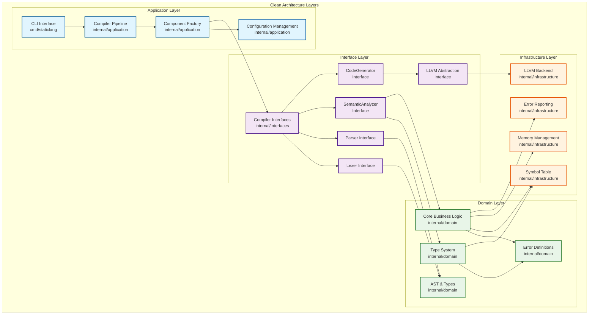

# StaticLang Compiler Architecture

## Overview

The StaticLang compiler follows **Clean Architecture** principles with clear separation of concerns across multiple layers. The architecture is designed to be maintainable, testable, and extensible.

## Layer Architecture



## Component Architecture

### Compilation Pipeline

The compilation process flows through four main phases:

1. **Lexical Analysis** - Tokenization of source code
2. **Syntax Analysis** - AST construction from tokens
3. **Semantic Analysis** - Type checking and symbol resolution
4. **Code Generation** - LLVM IR emission

```
Input Source → Lexer → Parser → Semantic Analyzer → Code Generator → LLVM IR
              ↓         ↓           ↓                    ↓
           Tokens    AST       Typed AST         LLVM Module
```

### Key Interfaces

#### CompilerPipeline
- `Compile(filename, input, output)` - Main compilation entry point
- Orchestrates all compilation phases
- Manages error handling and reporting

#### Lexer
- `NextToken()` - Returns the next token from input
- `SetInput(filename, reader)` - Sets input source  
- Handles source position tracking
- **Token Classification**: Type keywords (`int`, `string`, etc.) are treated as identifiers and resolved by the type system, not as special tokens

#### Parser
- `Parse(lexer)` - Constructs AST from token stream
- Implements recursive descent parsing
- Reports syntax errors with location information

#### SemanticAnalyzer
- `Analyze(ast)` - Performs semantic analysis on AST
- Type checking and inference
- Symbol resolution and scope management

#### CodeGenerator
- `Generate(ast)` - Generates LLVM IR from typed AST
- Uses visitor pattern for AST traversal
- Manages LLVM context and module creation

## AST Design

### Node Hierarchy

All AST nodes implement the `Node` interface:
- `GetLocation()` - Returns source location
- `Accept(visitor)` - Visitor pattern support

#### Expression Nodes
- `LiteralExpr` - Literal values (int, float, string, bool)
- `IdentifierExpr` - Variable references
- `BinaryExpr` - Binary operations (+, -, *, /, ==, etc.)
- `UnaryExpr` - Unary operations (-, !)
- `CallExpr` - Function calls
- `IndexExpr` - Array indexing
- `MemberExpr` - Struct member access

#### Statement Nodes
- `ExprStmt` - Expression statements
- `VarDeclStmt` - Variable declarations
- `AssignStmt` - Assignment statements
- `IfStmt` - Conditional statements
- `WhileStmt` - Loop statements
- `ForStmt` - For loops
- `ReturnStmt` - Return statements
- `BlockStmt` - Statement blocks

#### Declaration Nodes
- `FunctionDecl` - Function declarations
- `StructDecl` - Struct type declarations
- `Program` - Top-level program node

### Visitor Pattern

The AST uses the visitor pattern for traversal operations:
- Type checking visitor
- Code generation visitor
- Pretty printing visitor
- Optimization passes

## Type System

### Type Hierarchy

```go
Type interface
├── BasicType (int, float, bool, string, void)
├── ArrayType ([N]T, []T)
├── StructType (user-defined structs)
├── FunctionType (func(params) -> return)
└── ErrorType (for type errors)
```

### Type Operations
- `Equals(other)` - Type equality checking
- `IsAssignableFrom(other)` - Assignment compatibility
- `GetSize()` - Memory size calculation

### Type Registry
- Manages type definitions
- Creates and validates struct types
- Provides builtin type access

## Symbol Table

### Scope Management
- Hierarchical scope structure
- Symbol lookup with scope chain traversal
- Support for nested scopes

### Symbol Types
- Variables
- Functions
- Parameters
- Struct types
- Struct fields

## Error Handling

### Error Types
- `LexicalError` - Tokenization errors
- `SyntaxError` - Parsing errors
- `SemanticError` - Semantic analysis errors
- `TypeError` - Type checking errors
- `CodeGenError` - Code generation errors

### Error Reporting
- Source location tracking
- Context information
- Helpful error messages with suggestions
- Support for multiple error formats

### Error Reporter Implementations
- `ConsoleErrorReporter` - Console output with source context
- `SortedErrorReporter` - Sorts errors by location
- `TrackingErrorReporter` - Detailed error tracking

## Memory Management

### Memory Manager Types
- `PooledMemoryManager` - Type-specific memory pools
- `CompactMemoryManager` - Simple allocation tracking
- `TrackingMemoryManager` - Detailed allocation logging

### Features
- Node-specific memory pools
- String deduplication with reference counting
- Memory usage statistics
- Automatic cleanup on compilation completion

## LLVM Integration

### Abstraction Layer
The LLVM backend is abstracted through interfaces to:
- Enable testing with mock implementations
- Support potential alternative backends
- Isolate LLVM-specific details

### Key Components
- `LLVMBackend` - Main backend interface
- `LLVMModule` - Module abstraction
- `LLVMFunction` - Function representation
- `LLVMBuilder` - Instruction builder
- `LLVMType` - Type system bridge

### Code Generation Strategy
1. Create LLVM module and context
2. Declare all functions and globals
3. Generate function bodies using visitor pattern
4. Optimize generated code
5. Emit object code or assembly

## Extensibility Points

### Adding New Language Features
1. **Lexer**: Add new token types
2. **Parser**: Extend grammar rules and AST nodes
3. **Type System**: Add new type categories
4. **Semantic Analysis**: Implement type checking rules
5. **Code Generation**: Add visitor methods for new nodes

### Plugin Architecture Considerations
The current architecture can be extended to support plugins through:
- Interface-based component registration
- Dynamic loading of compiler passes
- Extensible error reporting
- Custom optimization passes

## Testing Strategy

### Unit Testing
- Mock implementations for all interfaces
- Isolated testing of each component
- Type system validation tests
- AST construction and traversal tests

### Integration Testing
- End-to-end compilation pipeline tests
- Multi-file compilation tests
- Error handling and recovery tests
- Mock vs. real component validation

### Parser Testing
- Complex program parsing with multiple declarations
- Token type validation and identifier resolution
- Error recovery and reporting
- Grammar compliance verification

### Performance Testing
- Memory usage profiling
- Compilation time benchmarks
- Generated code quality assessment

### Test Architecture
The testing strategy maintains clean architecture principles:
- **Mock Components**: Enable isolated testing of each layer
- **Interface Contracts**: Tests validate interface compliance
- **Component Integration**: End-to-end tests verify proper component interaction
- **Error Handling**: Comprehensive error scenario coverage

## Build Integration

### Goyacc Integration
The parser can be generated from a grammar file using Goyacc:
```bash
goyacc -o parser.go grammar.y
```

### Build Process
1. Generate parser from grammar (if needed)
2. Build compiler binary
3. Run tests and benchmarks
4. Generate documentation

## Future Enhancements

### Planned Features
- Incremental compilation
- Language server protocol support
- Advanced optimizations
- Debugging information generation
- Package system

### Architectural Improvements
- Hot-swappable compilation phases
- Parallel compilation support
- Distributed compilation
- Caching and memoization

## File Structure

```
staticlang/
├── cmd/staticlang/           # CLI application entry point
├── internal/                 # Internal packages (Clean Architecture layers)
│   ├── application/          # Application layer - Use case orchestration
│   │   ├── compiler_pipeline.go    # Main compilation pipeline
│   │   └── compiler_factory.go     # Component factory and configuration
│   ├── domain/               # Domain layer - Core business logic
│   │   ├── ast.go                 # AST node definitions
│   │   ├── types.go               # Type system definitions
│   │   └── type_system.go         # Type system implementation
│   ├── interfaces/           # Interface layer - Contracts and abstractions
│   │   └── compiler.go            # Compiler component interfaces
│   └── infrastructure/       # Infrastructure layer - External concerns
│       ├── llvm_backend.go         # LLVM backend implementation
│       ├── symboltable.go          # Symbol table implementation
│       ├── error_reporter.go       # Error reporting implementation
│       └── memory_manager.go       # Memory management implementation
├── examples/                 # Example programs
├── tests/                    # Test files and suites
└── docs/                     # Additional documentation
```

This architecture provides a solid foundation for a production-ready compiler that is maintainable, testable, and extensible.
