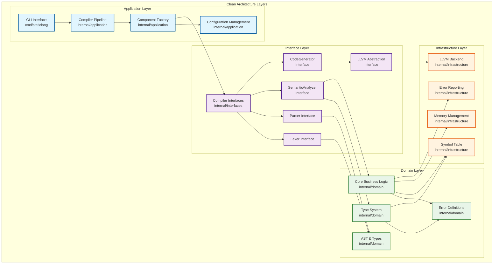

# StaticLang Compiler Architecture

## Tech Stack

- **Language**: Go 1.21+
- **Target**: LLVM Intermediate Representation
- **Runtime**: Native executable via clang/LLVM
- **System**: Cross-platform (Linux, macOS, Windows)
- **Architecture Pattern**: Clean Architecture (layered design with clear boundaries)
- **Parser Generator**: goyacc (Go yacc-compatible for parser generation)

## Overview

The StaticLang compiler follows **Clean Architecture** principles with clear separation of concerns across multiple layers. The architecture is designed to be maintainable, testable, and extensible.

The compiler rigorously implements **Clean Architecture** principles with strict separation of concerns across four distinct layers. Each layer maintains clear boundaries and interfaces, ensuring high testability, maintainability, and extensibility.

## StaticLang Language Grammar

### Grammar Overview

StaticLang uses a formal Yacc/Bison grammar (`grammar/staticlang.y`) that defines:

**Language Structure:**

- **Program**: Sequence of top-level declarations (functions, structs, global variables)
- **Declarations**: Function declarations, struct declarations, global variable declarations
- **Statements**: Variable declarations, assignments, control flow, expressions
- **Expressions**: Binary operations, unary operations, function calls, literals

**Key Features:**

- **Tokens**: Literals (int, float, string, bool), keywords (func, struct, var, if, else, while, for, return), operators, delimiters
- **Precedence Rules**: Logical OR/AND → Equality → Relational → Additive → Multiplicative → Unary
- **Error Recovery**: Parser attempts to continue after syntax errors
- **Location Tracking**: Source position information for debugging and error reporting

### Grammar Productions Summary

#### Program Structure

```text
program → declaration_list | ε
declaration_list → declaration | declaration_list declaration
declaration → function_decl | struct_decl | global_var_decl
```

#### Function Declarations (Multiple Forms)

- `func identifier(parameters) → type { block }`
- `func identifier() → type { block }`
- `func identifier(parameters) { block }` (default int return)
- `func identifier() { block }` (default int return)

#### Type Grammar Productions

```text
type → identifier | [size]type | []type
parameter_list → parameter | parameter_list, parameter
parameter → identifier type
```

#### Statements

```text
statement → var_decl_stmt | assign_stmt | if_stmt | while_stmt | for_stmt | return_stmt | expr_stmt | block_stmt
if_stmt → if (expression) statement | if (expression) statement else statement
while_stmt → while (expression) statement
for_stmt → for (init; condition; update) statement
```

#### Expressions (Full Operator Precedence)

- **Logical**: OR, AND
- **Equality**: ==, !=
- **Relational**: <, <=, >, >=
- **Arithmetic**: +, -, *, /, %
- **Unary**: -, !

## StaticLang Language Syntax

### Basic Data Types

StaticLang supports the following basic data types:

- `int` - Integer type
- `float` - Floating-point type
- `string` - String type
- `bool` - Boolean type

### Function Declarations

Functions are declared using the following syntax:

```go
func functionName(param1 int, param2 string) -> int {
    // Function body
    return result;
}

// Without parameters
func functionName() -> int {
    return 42;
}

// Without return type (defaults to int)
func functionName(param int) {
    // Processing code
}
```

### Variable Declarations

Variables are declared as follows:

```go
// Without initialization
var x int;
var message string;

// With initialization
var x int = 42;
var pi float = 3.14;
var name string = "Hello";
```

### Control Structures

#### Conditional Statements

```go
if (condition) {
    // Code executed when condition is true
} else {
    // Code executed when condition is false
}
```

#### Loops

```go
// while loop
while (condition) {
    // Loop body
}

// for loop
for (var i int = 0; i < 10; i = i + 1) {
    // Loop body
}
```

### Expressions and Operators

#### Arithmetic Operators

- `+` (Addition)
- `-` (Subtraction)
- `*` (Multiplication)
- `/` (Division)
- `%` (Modulo)

#### Comparison Operators

- `==` (Equal to)
- `!=` (Not equal to)
- `<` (Less than)
- `>` (Greater than)
- `<=` (Less than or equal to)
- `>=` (Greater than or equal to)

#### Logical Operators

- `&&` (Logical AND)
- `||` (Logical OR)
- `!` (Logical NOT)

### Structs and Arrays

```go
// Struct definition
struct Person {
    name string;
    age int;
    height float;
}

// Struct usage
var person Person;
person.name = "John";
person.age = 30;

// Arrays
var numbers [5]int;
var dynamicArray []int;
numbers[0] = 10;

// Struct member access
var age int = person.age;
```

### Function Calls

```go
// Function call
var result int = fibonacci(10);

// Recursion
func fibonacci(n int) -> int {
    if (n <= 1) {
        return n;
    } else {
        return fibonacci(n - 1) + fibonacci(n - 2);
    }
}
```

## Layer Architecture



## Component Architecture

### Compilation Pipeline

The compilation process flows through four main phases:

1. **Lexical Analysis** - Tokenization of source code
2. **Syntax Analysis** - AST construction from tokens
3. **Semantic Analysis** - Type checking and symbol resolution
4. **Code Generation** - LLVM IR emission

```text
Input Source → Lexer → Parser → Semantic Analyzer → Code Generator → LLVM IR
              ↓         ↓           ↓                    ↓
           Tokens    AST       Typed AST         LLVM Module
```

### Key Interfaces

#### CompilerPipeline

- `Compile(filename, input, output)` - Main compilation entry point
- Orchestrates all compilation phases
- Manages error handling and reporting

#### Lexer

- `NextToken()` - Returns the next token from input
- `SetInput(filename, reader)` - Sets input source
- Handles source position tracking
- **Token Classification**: Type keywords (`int`, `string`, etc.) are treated as identifiers and resolved by the type system, not as special tokens

#### Parser

- `Parse(lexer)` - Constructs AST from token stream
- Implements recursive descent parsing
- Reports syntax errors with location information

#### SemanticAnalyzer

- `Analyze(ast)` - Performs semantic analysis on AST
- Type checking and inference
- Symbol resolution and scope management

#### CodeGenerator

- `Generate(ast)` - Generates LLVM IR from typed AST
- Uses visitor pattern for AST traversal
- Manages LLVM context and module creation

## AST Design

### Node Hierarchy

All AST nodes implement the `Node` interface:

- `GetLocation()` - Returns source location
- `Accept(visitor)` - Visitor pattern support

#### Expression Nodes

- `LiteralExpr` - Literal values (int, float, string, bool)
- `IdentifierExpr` - Variable references
- `BinaryExpr` - Binary operations (+, -, *, /, ==, etc.)
- `UnaryExpr` - Unary operations (-, !)
- `CallExpr` - Function calls
- `IndexExpr` - Array indexing
- `MemberExpr` - Struct member access

#### Statement Nodes

- `ExprStmt` - Expression statements
- `VarDeclStmt` - Variable declarations
- `AssignStmt` - Assignment statements
- `IfStmt` - Conditional statements
- `WhileStmt` - Loop statements
- `ForStmt` - For loops
- `ReturnStmt` - Return statements
- `BlockStmt` - Statement blocks

#### Declaration Nodes

- `FunctionDecl` - Function declarations
- `StructDecl` - Struct type declarations
- `Program` - Top-level program node

### Visitor Pattern

The AST uses the visitor pattern for traversal operations:

- Type checking visitor
- Code generation visitor
- Pretty printing visitor
- Optimization passes

## Type System

### Type Hierarchy

```go
Type interface
├── BasicType (int, float, bool, string, void)
├── ArrayType ([N]T, []T)
├── StructType (user-defined structs)
├── FunctionType (func(params) -> return)
└── ErrorType (for type errors)
```

### Type Operations

- `Equals(other)` - Type equality checking
- `IsAssignableFrom(other)` - Assignment compatibility
- `GetSize()` - Memory size calculation

### Type Registry

- Manages type definitions
- Creates and validates struct types
- Provides builtin type access

## Symbol Table

### Scope Management

- Hierarchical scope structure
- Symbol lookup with scope chain traversal
- Support for nested scopes

### Symbol Types

- Variables
- Functions
- Parameters
- Struct types
- Struct fields

## Error Handling

### Error Types

- `LexicalError` - Tokenization errors
- `SyntaxError` - Parsing errors
- `SemanticError` - Semantic analysis errors
- `TypeError` - Type checking errors
- `CodeGenError` - Code generation errors

### Error Reporting

- Source location tracking
- Context information
- Helpful error messages with suggestions
- Support for multiple error formats

### Error Reporter Implementations

- `ConsoleErrorReporter` - Console output with source context
- `SortedErrorReporter` - Sorts errors by location
- `TrackingErrorReporter` - Detailed error tracking

## Memory Management

### Memory Manager Types

- `PooledMemoryManager` - Type-specific memory pools
- `CompactMemoryManager` - Simple allocation tracking
- `TrackingMemoryManager` - Detailed allocation logging

### Features

- Node-specific memory pools
- String deduplication with reference counting
- Memory usage statistics
- Automatic cleanup on compilation completion

## LLVM Integration

### Abstraction Layer

The LLVM backend is abstracted through interfaces to:

- Enable testing with mock implementations
- Support potential alternative backends
- Isolate LLVM-specific details

### Key Components

- `LLVMBackend` - Main backend interface
- `LLVMModule` - Module abstraction
- `LLVMFunction` - Function representation
- `LLVMBuilder` - Instruction builder
- `LLVMType` - Type system bridge

### Code Generation Strategy

1. Create LLVM module and context
2. Declare all functions and globals
3. Generate function bodies using visitor pattern
4. Optimize generated code
5. Emit object code or assembly

## Extensibility Points

### Adding New Language Features

1. **Lexer**: Add new token types
2. **Parser**: Extend grammar rules and AST nodes
3. **Type System**: Add new type categories
4. **Semantic Analysis**: Implement type checking rules
5. **Code Generation**: Add visitor methods for new nodes

### Plugin Architecture Considerations

The current architecture can be extended to support plugins through:

- Interface-based component registration
- Dynamic loading of compiler passes
- Extensible error reporting
- Custom optimization passes

## Testing Strategy

### Unit Testing

- Mock implementations for all interfaces
- Isolated testing of each component
- Type system validation tests
- AST construction and traversal tests

### Integration Testing

- End-to-end compilation pipeline tests
- Multi-file compilation tests
- Error handling and recovery tests
- Mock vs. real component validation

### Parser Testing

- Complex program parsing with multiple declarations
- Token type validation and identifier resolution
- Error recovery and reporting
- Grammar compliance verification

### Performance Testing

- Memory usage profiling
- Compilation time benchmarks
- Generated code quality assessment

### Test Architecture

The testing strategy maintains clean architecture principles:

- **Mock Components**: Enable isolated testing of each layer
- **Interface Contracts**: Tests validate interface compliance
- **Component Integration**: End-to-end tests verify proper component interaction
- **Error Handling**: Comprehensive error scenario coverage

## Build Integration

### Goyacc Integration

The parser can be generated from a grammar file using Goyacc:

```bash
goyacc -o parser.go grammar.y
```

### Build Process

1. Generate parser from grammar (if needed)
2. Build compiler binary
3. Run tests and benchmarks
4. Generate documentation

## Future Enhancements

### Planned Features

- Incremental compilation
- Language server protocol support
- Advanced optimizations
- Debugging information generation
- Package system

### Architectural Improvements

- Hot-swappable compilation phases
- Parallel compilation support
- Distributed compilation
- Caching and memoization

## File Structure

```text
staticlang/
├── cmd/staticlang/           # CLI application entry point
├── internal/                 # Internal packages (Clean Architecture layers)
│   ├── application/          # Application layer - Use case orchestration
│   │   ├── compiler_pipeline.go    # Main compilation pipeline
│   │   └── compiler_factory.go     # Component factory and configuration
│   ├── domain/               # Domain layer - Core business logic
│   │   ├── ast.go                 # AST node definitions
│   │   ├── types.go               # Type system definitions
│   │   └── type_system.go         # Type system implementation
│   ├── interfaces/           # Interface layer - Contracts and abstractions
│   │   └── compiler.go            # Compiler component interfaces
│   └── infrastructure/       # Infrastructure layer - External concerns
│       ├── llvm_backend.go         # LLVM backend implementation
│       ├── symboltable.go          # Symbol table implementation
│       ├── error_reporter.go       # Error reporting implementation
│       └── memory_manager.go       # Memory management implementation
├── examples/                 # Example programs
├── tests/                    # Test files and suites
└── docs/                     # Additional documentation
```

## Language Grammar Analysis Summary

### StaticLang Language Characteristics

**Paradigm:**

- **Statically Typed**: All variables and expressions have explicit types known at compile time
- **Compiled Language**: Translates to machine code via LLVM IR for optimal performance
- **Pascal-like Syntax**: Familiar C-like syntax with explicit variable declarations

**Core Features:**

- **First-Class Functions**: Functions can be passed as parameters and returned as values
- **Structural Types**: User-defined structs with field access
- **Array Support**: Both fixed-size arrays `[N]T` and dynamic arrays `[]T`
- **Complete Control Flow**: if/else, while, for loops with break semantics
- **Full Operator Suite**: Arithmetic, comparison, logical, and assignment operators
- **String Support**: Builtin string type with print functions

### Compiler Architecture Analysis

**Architecture Maturity:**

- **Clean Architecture**: Four-layer architecture with strict separation of concerns
- **Production Ready**: Real LLVM IR generation (not just mock implementations)
- **Extensible Design**: Plugin architecture through interface contracts
- **Error Resilient**: Comprehensive error handling with location tracking

**Compiler Pipeline:**

1. **Lexer** (`internal/lexer/`): Tokenization with type keyword special handling
2. **Parser** (`grammar/parser.go`): Recursive descent with operator precedence
3. **Semantic Analyzer** (`internal/semantic/`): Type checking and symbol resolution
4. **Code Generator** (`internal/codegen/`): LLVM IR emission with visitor patterns
5. **Error Reporter** (`internal/infrastructure/`): Context-aware error messaging

**Key Technical Decisions:**

- **Recursive Descent Parsing**: Simpler than operator precedence issues (goyacc fallback available)
- **Visitor Pattern**: Consistent AST traversal for analysis and code generation
- **Dependency Injection**: Component factory pattern for testability
- **Memory Pooling**: Type-specific allocation for performance optimization
- **Abstract Backend Interface**: LLVM backend replaceable through interface contracts

**Type System Features:**

- **Built-in Types**: int, float, string, bool with implicit conversion rules
- **Array Types**: Fixed and dynamic array support with type safety
- **Function Types**: Parameter and return type specifications
- **Struct Types**: User-defined composite types with field access
- **Type Registry**: Centralized type management and validation
- **Type Equality**: Deep type comparison for assignment and parameter compatibility

**Error Handling Strategy:**

- **Structured Errors**: Typed error hierarchy with source location
- **Recovery Mechanisms**: Parser attempts to recover from syntax errors
- **Context Information**: Detailed error messages with code snippets
- **Multiple Reporter Types**: Console, sorted, and tracking implementations
- **Position Tracking**: Accurate source location reporting (known TODOs in string literals)

This architecture provides a solid foundation for a production-ready compiler that is maintainable, testable, and extensible.
