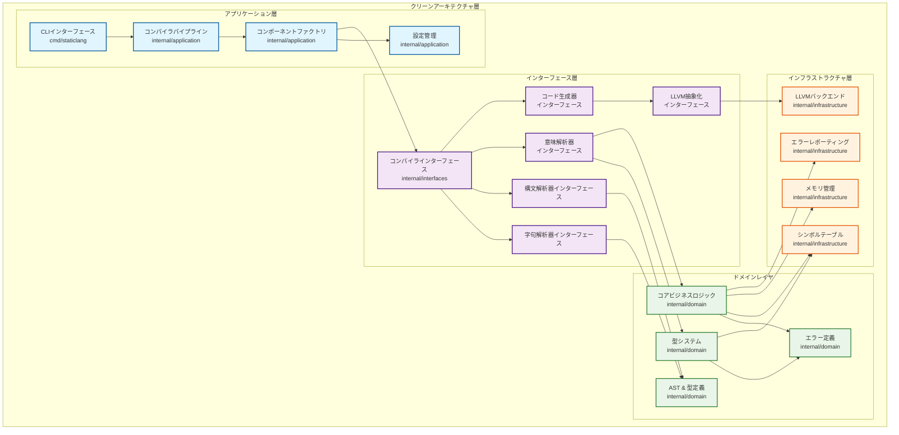

# StaticLang コンパイラ アーキテクチャ

## 概要

StaticLangは、Go言語とLLVMをベースにした静的型付けプログラミング言語のコンパイラです。本プロジェクトはクリーンアーキテクチャの原則に従い、懸念事項の明確な分離を実現しています。

## 言語仕様 (StaticLang Syntax)

### 基本データ型

StaticLangは以下の基本データ型をサポートしています：

- `int` - 整数型
- `float` - 浮動小数点型
- `string` - 文字列型
- `bool` - 論理型

### 関数宣言

関数は以下のような構文で宣言します：

```go
func functionName(param1 int, param2 string) -> int {
    // 関数本体
    return result;
}

// 引数なしの場合
func functionName() -> int {
    return 42;
}

// 戻り値なしの場合
func functionName(param int) {
    // 処理内容
}
```

### 変数宣言

変数は以下のように宣言します：

```go
// 初期化なし
var x int;
var message string;

// 初期化あり
var x int = 42;
var pi float = 3.14;
var name string = "Hello";
```

### 制御構造

#### 条件分岐
```go
if (condition) {
    // 条件が真の場合の処理
} else {
    // 条件が偽の場合の処理
}
```

#### 繰り返し処理
```go
// while文
while (condition) {
    // 繰り返し処理
}

// for文
for (var i int = 0; i < 10; i = i + 1) {
    // 繰り返し処理
}
```

### 式と演算子

#### 算術演算子
- `+` (加算)
- `-` (減算)
- `*` (乗算)
- `/` (除算)
- `%` (剰余)

#### 比較演算子
- `==` (等しい)
- `!=` (等しくない)
- `<` (より小さい)
- `>` (より大きい)
- `<=` (以下)
- `>=` (以上)

#### 論理演算子
- `&&` (論理AND)
- `||` (論理OR)
- `!` (論理NOT)

### 構造体と配列

```go
// 構造体定義
struct Person {
    name string;
    age int;
    height float;
}

// 構造体使用
var person Person;
person.name = "John";
person.age = 30;

// 配列
var numbers [5]int;
var dynamicArray []int;
numbers[0] = 10;

// 構造体メンバアクセス
var age int = person.age;
```

### 関数呼び出し

```go
// 関数呼び出し
var result int = fibonacci(10);

// 再帰呼び出し
func fibonacci(n int) -> int {
    if (n <= 1) {
        return n;
    } else {
        return fibonacci(n - 1) + fibonacci(n - 2);
    }
}
```

## アーキテクチャ概要

### クリーンアーキテクチャ

StaticLangコンパイラは4層のクリーンアーキテクチャを採用しています：



### 各層の役割

#### ドメインレイヤ (Domain Layer)
- **ASTノード定義**: 抽象構文木の構造体とインターフェース
- **型システム**: 言語の型定義と型チェック規則
- **ビジネスロジック**: コンパイラの中核となる処理
- **エラー定義**: コンパイルエラーの種類とメッセージ

#### インターフェース層 (Interface Layer)
- **コンポーネントインターフェース**: 各コンパイラコンポーネントの契約
- **抽象化レイヤ**: 具体的な実装から独立したインターフェース
- **依存関係の逆転**: 上位層が下位層に依存しない設計

#### アプリケーション層 (Application Layer)
- **CLIインターフェース**: コマンドラインからのコンパイラ操作
- **コンパイラパイプライン**: コンパイルプロセスの全体制御
- **コンポーネントファクトリ**: 各コンポーネントの生成と設定
- **設定管理**: コンパイルオプションと環境設定

#### インフラストラクチャ層 (Infrastructure Layer)
- **LLVMバックエンド**: LLVM IR生成と最適化
- **シンボルテーブル**: 変数・関数などのシンボル管理
- **メモリ管理**: ASTノードのメモリプール管理
- **エラーレポーティング**: 詳細なエラーメッセージと位置情報

## コンパイルパイプライン

### 処理フロー

コンパイルプロセスは以下の4段階で進行します：

1. **字句解析 (Lexical Analysis)**: ソースコードのトークン化
2. **構文解析 (Syntax Analysis)**: トークンからAST構築
3. **意味解析 (Semantic Analysis)**: 型チェックとシンボル解決
4. **コード生成 (Code Generation)**: LLVM IR生成

```
入力ソース → 字句解析器 → 構文解析器 → 意味解析器 → コード生成器 → LLVM IR
            ↓             ↓             ↓              ↓
         トークン        AST         型付きAST     LLVMモジュール
```

### 主要コンポーネント

#### 字句解析器 (Lexer)
- `NextToken()`: 次のトークンを返す
- `SetInput()`: 入力ソースの設定
- ソース位置追跡機能付き
- **型キーワードの扱い**: `int`、`string`などの型キーワードは識別子として扱われ、型システムによって解決される

#### 構文解析器 (Parser)
- `Parse()`: トークンストリームからASTを構築
- 再帰下降型パーサーを実装
- 構文エラーを位置情報付きで報告

#### 意味解析器 (SemanticAnalyzer)
- `Analyze()`: ASTに対して意味解析を実行
- 型チェックと型推論
- シンボル解決とスコープ管理

#### コード生成器 (CodeGenerator)
- `Generate()`: 型付きASTからLLVM IRを生成
- ビジターパターンを用いたAST走査
- LLVMコンテキストとモジュール作成を管理

## AST設計

### ノード階層

すべてのASTノードは`Node`インターフェースを実装：
- `GetLocation()`: ソース位置を返す
- `Accept(visitor)`: ビジターパターン対応

#### 式ノード (Expression Nodes)
- `LiteralExpr`: リテラル値（数値、文字列、論理値）
- `IdentifierExpr`: 変数参照
- `BinaryExpr`: 二項演算（算術、比較、論理）
- `UnaryExpr`: 単項演算（符号反転、論理否定）
- `CallExpr`: 関数呼び出し
- `IndexExpr`: 配列インデックスアクセス
- `MemberExpr`: 構造体メンバアクセス

#### 文ノード (Statement Nodes)
- `ExprStmt`: 式文
- `VarDeclStmt`: 変数宣言
- `AssignStmt`: 代入文
- `IfStmt`: 条件分岐
- `WhileStmt`: whileループ
- `ForStmt`: forループ
- `ReturnStmt`: return文
- `BlockStmt`: 文ブロック

#### 宣言ノード (Declaration Nodes)
- `FunctionDecl`: 関数宣言
- `StructDecl`: 構造体宣言
- `Program`: トップレベルプログラムノード

### ビジターパターン

ASTはビジターパターンを用いた走査操作を実装：
- 型チェック用ビジター
- コード生成用ビジター
- プリティプリント用ビジター
- 最適化パス

## 型システム

### 型階層

```go
Type interface
├── BasicType (int, float, bool, string, void)
├── ArrayType ([N]T, []T)
├── StructType (ユーザ定義構造体)
├── FunctionType (func(params) -> return)
└── ErrorType (型エラー用)
```

### 型操作
- `Equals(other)`: 型等価性チェック
- `IsAssignableFrom(other)`: 代入互換性チェック
- `GetSize()`: メモリサイズ計算

### 型レジストリ
- 型定義の管理
- 構造体の作成と検証
- 組み込み型のアクセス提供

## シンボルテーブル

### スコープ管理
- 階層的スコープ構造
- スコープチェーン走査によるシンボル検索
- ネストされたスコープのサポート

### シンボル種類
- 変数
- 関数
- パラメータ
- 構造体型
- 構造体フィールド

## エラーハンドリング

### エラーの種類
- `LexicalError`: トークン化エラー
- `SyntaxError`: パースエラー
- `SemanticError`: 意味解析エラー
- `TypeError`: 型チェックエラー
- `CodeGenError`: コード生成エラー

### エラーレポーティング
- ソース位置追跡
- 文脈情報
- 提案付きの役立つエラーメッセージ
- 複数エラー形式のサポート

### エラーレポーター実装
- `ConsoleErrorReporter`: コンソール出力（ソース文脈付き）
- `SortedErrorReporter`: 位置順エラーソート
- `TrackingErrorReporter`: 詳細なエラートラッキング

## メモリ管理

### メモリマネージャ種類
- `PooledMemoryManager`: 型別メモリプール
- `CompactMemoryManager`: シンプルな割り当て追跡
- `TrackingMemoryManager`: 詳細な割り当てログ

### 機能
- ノード別メモリプール
- 参照カウント付き文字列重複排除
- メモリ使用統計
- コンパイル完了時の自動クリーンアップ

## LLVM統合

### 抽象化レイヤ
LLVMバックエンドはインターフェースを通じて抽象化：
- テスト用モック実装の有効化
- 代替バックエンドのサポート
- LLVM固有の詳細の分離

### 主なコンポーネント
- `LLVMBackend`: メインのバックエンドインターフェース
- `LLVMModule`: モジュール抽象化
- `LLVMFunction`: 関数表現
- `LLVMBuilder`: 命令ビルダー
- `LLVMType`: 型システムブリッジ

### コード生成戦略
1. LLVMモジュールとコンテキストの作成
2. すべての関数とグローバル変数の宣言
3. ビジターパターンを用いた関数本体の生成
4. 生成コードの最適化
5. オブジェクトコードまたはアセンブリ出力

## 拡張性ポイント

### 新言語機能の追加
1. **字句解析器**: 新しいトークンタイプの追加
2. **構文解析器**: 文法規則とASTノードの拡張
3. **型システム**: 新しい型カテゴリの追加
4. **意味解析**: 型チェック規則の実装
5. **コード生成**: 新ノード用のビジターメソッド追加

### プラグインアーキテクチャ
現在のアーキテクチャは以下の機能をサポート：
- インターフェースベースのコンポーネント登録
- コンパイルパスの動的読み込み
- 拡張可能なエラーレポーティング
- カスタム最適化パス

## テスト戦略

### 単体テスト
- すべてのインターフェースに対するモック実装
- 各コンポーネントの分離テスト
- 型システム検証テスト
- AST構築と走査テスト

### 統合テスト
- エンドツーエンドのコンパイルパイプラインテスト
- マルチファイルコンパイルテスト
- エラーハンドリングと回復テスト
- モック vs リアルコンポーネント検証

### パーサーテスト
- 複数の宣言を含む複雑なプログラムのパース
- トークンタイプ検証と識別子解決
- エラー回復と報告
- 文法準拠検証

### パフォーマンステスト
- メモリ使用プロファイリング
- コンパイル時間ベンチマーク
- 生成コード品質評価

## ビルド統合

### Goyacc統合
文法ファイルからパーサーを生成：
```bash
goyacc -o parser.go grammar.y
```

### ビルドプロセス
1. 文法からのパーサー生成（必要に応じて）
2. コンパイラバイナリのビルド
3. テストとベンチマーク実行
4. ドキュメント生成

## 技術スタック

- **言語**: Go 1.21+
- **バックエンド**: LLVM 15+（開発用モック実装付き）
- **パーサー生成**: Goyacc（再帰下降型フォールバック付き）
- **ビルドシステム**: Make + Goモジュール
- **テスト**: Go内蔵テストフレームワーク

## ファイル構造

```
staticlang/
├── cmd/staticlang/              # CLIアプリケーションエントリポイント
├── internal/                    # 内部パッケージ（クリーンアーキテクチャ層）
│   ├── application/             # アプリケーションレイヤ - ユースケースオーケストレーション
│   │   ├── compiler_pipeline.go     # メインコンパイルパイプライン
│   │   └── compiler_factory.go      # コンポーネントファクトリと設定
│   ├── domain/                  # ドメインレイヤ - コアビジネスロジック
│   │   ├── ast.go                    # ASTノード定義
│   │   ├── types.go                  # 型システム定義
│   │   └── type_system.go            # 型システム実装
│   ├── interfaces/              # インターフェース層 - 契約と抽象化
│   │   └── compiler.go               # コンパイラコンポーネントインターフェース
│   └── infrastructure/          # インフラストラクチャ層 - 外部依存
│       ├── llvm_backend.go            # LLVMバックエンド実装
│       ├── symboltable.go             # シンボルテーブル実装
│       ├── error_reporter.go          # エラーレポーティング実装
│       └── memory_manager.go          # メモリ管理実装
├── examples/                   # サンプルプログラム
├── tests/                      # テストファイルとスイート
└── docs/                       # 追加ドキュメント
```

このアーキテクチャは、保守性とテスト可能性が高く、拡張性に優れたプロダクションレベルコンパイラの基盤を提供します。
