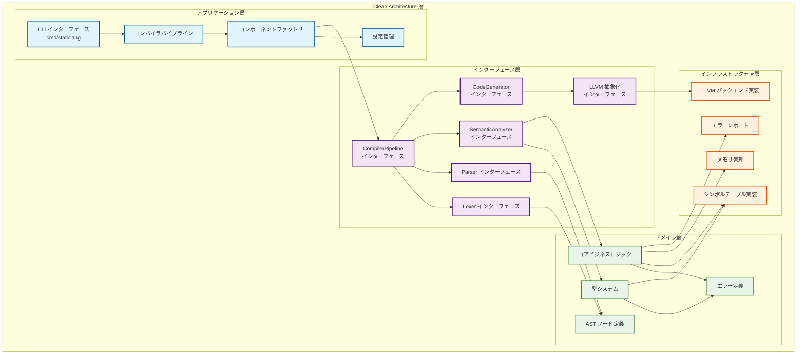
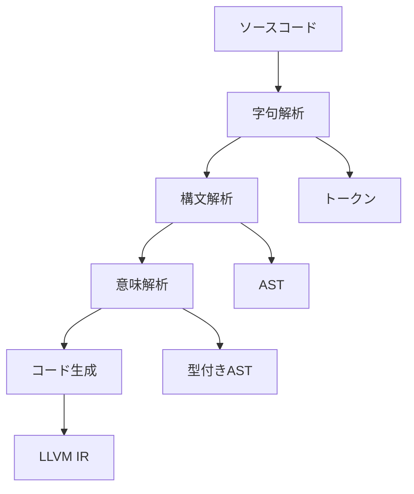
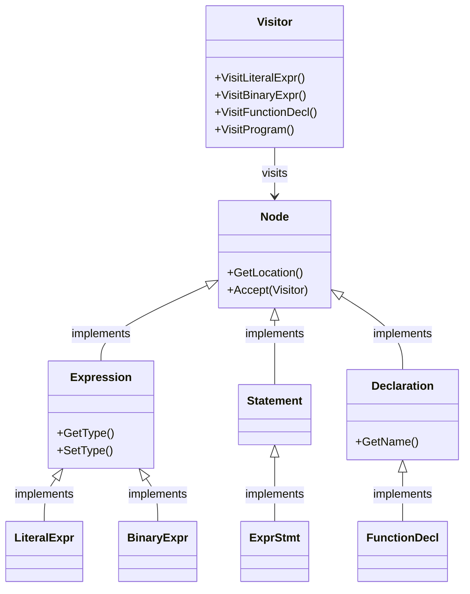
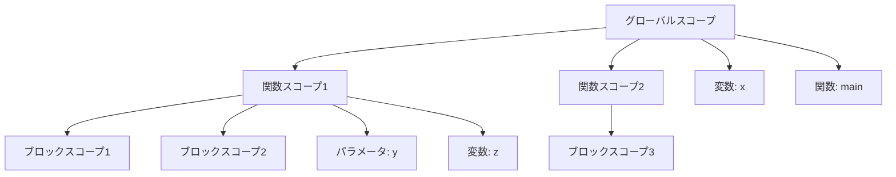
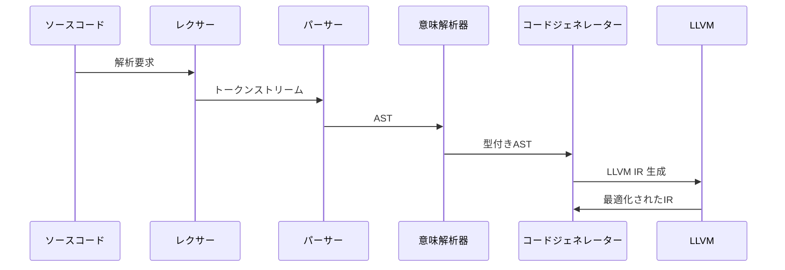
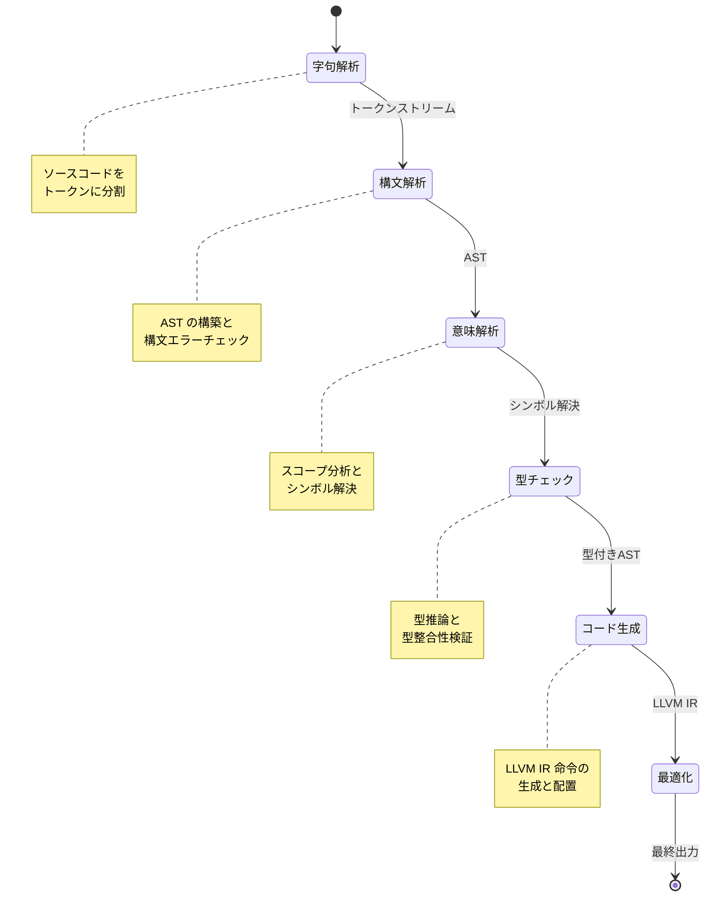
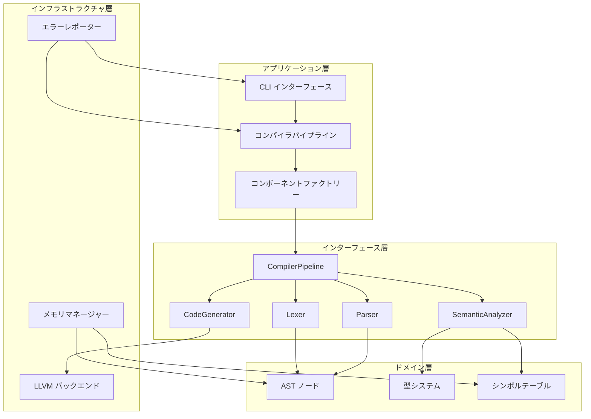

# StaticLang コンパイラ アーキテクチャ

## 概要

StaticLang コンパイラは、**Clean Architecture** の原則に従い、懸念事項の明確な分離により設計されています。このアーキテクチャは、保守性、テスト性、拡張性を考慮して設計されています。

## アーキテクチャ層



### Clean Architecture の原則

StaticLang コンパイラのアーキテクチャは、以下の **Clean Architecture** の原則を実践しています：

#### 1. 依存関係逆転の原則 (Dependency Inversion Principle)
- **外側 → 内側への依存禁止**: インフラストラクチャ層（外側）がドメイン層（内側）に依存することはなく、逆方向の依存のみが存在します
- **インターフェース経由の通信**: すべての層間通信はインターフェース層を通じて行われ、具象クラスへの直接依存を避けています
- **例**: `CodeGenerator` は `LLVMBackend` インターフェースに依存し、具体的な LLVM 実装には依存しません

#### 2. 単一責任の原則 (Single Responsibility Principle)
- **各層の明確な役割**:
  - **アプリケーション層**: ユースケースのオーケストレーション（CLI、コンパイラパイプライン）
  - **インターフェース層**: 契約と抽象化の定義（コンポーネントインターフェース）
  - **ドメイン層**: ビジネスルールとコアロジック（型システム、AST、意味解析）
  - **インフラストラクチャ層**: 外部システムとの統合（LLVM、ファイルシステム、メモリ管理）

#### 3. 関心の分離 (Separation of Concerns)
- **水平分離**: 各層が異なる種類の関心事を扱います
- **垂直分離**: 各コンポーネントが特定の責務を持ちます
- **例**:
  - エラーハンドリングは `ErrorReporter` で一元管理
  - 型チェックは `SemanticAnalyzer` で集約
  - コード生成は `CodeGenerator` で分離

#### 4. インターフェース分離の原則 (Interface Segregation Principle)
- **最小限のインターフェース**: 各インターフェースは必要最小限のメソッドのみを定義
- **ロール別インターフェース**: `Lexer`、`Parser`、`SemanticAnalyzer` など、役割ごとにインターフェースを分割
- **クライアント固有のインターフェース**: 使用する側が必要とするメソッドのみを公開

#### 5. 開放閉鎖の原則 (Open-Closed Principle)
- **拡張に対して開いている**: 新しい言語機能やバックエンドの追加が容易
- **修正に対して閉じている**: 既存コードの変更なしに拡張が可能
- **例**:
  - 新しい最適化パスの追加
  - 異なるバックエンド（LLVM 以外）の統合
  - 新しい言語機能の追加

### このアーキテクチャの利点

1. **テスト容易性**: インターフェースベースにより、各コンポーネントを独立してテスト可能
2. **保守性**: 明確な層分離により、変更の影響範囲を局所化
3. **拡張性**: 新機能の追加が既存コードに影響を与えにくい
4. **技術的負債の軽減**: 外部依存（LLVM、ファイルシステムなど）を分離し、交換可能に
5. **並列開発**: 各層の開発者がインターフェース契約に基づいて独立して作業可能

この Clean Architecture アプローチにより、StaticLang コンパイラは長期的な保守性と拡張性を確保しながら、本番環境での使用に適した堅牢な設計を実現しています。

## コンパイルパイプライン

StaticLang コンパイラは、4つの主要フェーズで構成されています：



### フェーズ詳細

1. **字句解析 (Lexical Analysis)** - ソースコードのトークン化
2. **構文解析 (Syntax Analysis)** - トークンからの AST 構築
3. **意味解析 (Semantic Analysis)** - 型チェックとシンボル解決
4. **コード生成 (Code Generation)** - 型付き AST からの LLVM IR 生成

```
ソースコード → レクサー → パーサー → 意味解析器 → コードジェネレーター → LLVM IR
             ↓         ↓           ↓                    ↓
          トークン    AST       型付きAST         LLVM モジュール
```

## 主要コンポーネント

### CompilerPipeline
- `Compile(filename, input, output)` - メインコンパイルエントリーポイント
- すべてのコンパイルフェーズをオーケストレーション
- エラーハンドリングとレポートを管理

### Lexer
- `NextToken()` - 入力から次のトークンを返す
- `SetInput(filename, reader)` - 入力ソースを設定
- ソース位置追跡を処理

### Parser
- `Parse(lexer)` - トークンストリームから AST を構築
- 再帰降下パーシングを実装
- 構文エラーを位置情報と共にレポート

### SemanticAnalyzer
- `Analyze(ast)` - AST に対して意味解析を実行
- 型チェックと推論
- シンボル解決とスコープ管理

### CodeGenerator
- `Generate(ast)` - 型付き AST から LLVM IR を生成
- ビジターパターンで AST トラバーサル
- LLVM コンテキストとモジュール作成を管理

## AST 設計

### ノード階層

すべての AST ノードは `Node` インターフェースを実装：
- `GetLocation()` - ソース位置を返す
- `Accept(visitor)` - ビジターパターンのサポート

#### 式ノード
- `LiteralExpr` - リテラル値 (int, float, string, bool)
- `IdentifierExpr` - 変数参照
- `BinaryExpr` - 二項演算 (+, -, *, /, ==, etc.)
- `UnaryExpr` - 単項演算 (-, !)
- `CallExpr` - 関数呼び出し
- `IndexExpr` - 配列インデックス
- `MemberExpr` - 構造体メンバアクセス

#### 文ノード
- `ExprStmt` - 式文
- `VarDeclStmt` - 変数宣言
- `AssignStmt` - 代入文
- `IfStmt` - 条件分岐
- `WhileStmt` - ループ文
- `ForStmt` - For ループ
- `ReturnStmt` - リターン文
- `BlockStmt` - 文ブロック

#### 宣言ノード
- `FunctionDecl` - 関数宣言
- `StructDecl` - 構造体型宣言
- `Program` - トップレベルプログラムノード

### ビジターパターン

AST はビジターパターンを使用してトラバーサル操作を行います：
- 型チェックビジター
- コード生成ビジター
- プリティプリンティングビジター
- 最適化パス



## 型システム

### 型階層

```go
Type interface
├── BasicType (int, float, bool, string, void)
├── ArrayType ([N]T, []T)
├── StructType (ユーザ定義構造体)
├── FunctionType (func(params) -> return)
└── ErrorType (型エラー用)
```

### 型操作
- `Equals(other)` - 型等価性チェック
- `IsAssignableFrom(other)` - 代入互換性
- `GetSize()` - メモリサイズ計算

### 型レジストリ
- 型定義を管理
- 構造体型を作成して検証
- ビルトイン型アクセスを提供

## シンボルテーブル

### スコープ管理
- 階層的スコープ構造
- スコープチェーンによるシンボル検索
- ネストされたスコープのサポート

### シンボル型
- 変数
- 関数
- パラメータ
- 構造体型
- 構造体フィールド



## エラーハンドリング

### エラーの種類
- `LexicalError` - 字句解析エラー
- `SyntaxError` - 構文解析エラー
- `SemanticError` - 意味解析エラー
- `TypeError` - 型チェックエラー
- `CodeGenError` - コード生成エラー

### エラーレポート
- ソース位置追跡
- コンテキスト情報
- 役立つエラーメッセージと提案
- 複数エラー形式のサポート

### エラーレポーター実装
- `ConsoleErrorReporter` - コンソール出力とソースコンテキスト
- `SortedErrorReporter` - 位置でソートされたエラー
- `TrackingErrorReporter` - 詳細なエラー追跡

## メモリ管理

### メモリマネージャーの種類
- `PooledMemoryManager` - 型別メモリプール
- `CompactMemoryManager` - シンプルな割り当て追跡
- `TrackingMemoryManager` - 詳細な割り当てログ

### 機能
- ノード別メモリプール
- 参照カウントによる文字列重複排除
- メモリ使用量統計
- コンパイル完了時の自動クリーンアップ

## LLVM 統合

### 抽象化層
LLVM バックエンドは、以下の目的でインターフェースを通じて抽象化されています：
- テスト用モック実装の有効化
- 潜在的な代替バックエンドのサポート
- LLVM 固有の詳細の分離

### 主なコンポーネント
- `LLVMBackend` - メインバックエンドインターフェース
- `LLVMModule` - モジュール抽象化
- `LLVMFunction` - 関数表現
- `LLVMBuilder` - 命令ビルダー
- `LLVMType` - 型システムブリッジ

### コード生成戦略
1. LLVM モジュールとコンテキストの作成
2. すべての関数とグローバル宣言
3. ビジターパターンを使用した関数本体生成
4. 生成されたコードの最適化
5. オブジェクトコードまたはアセンブリの生成



## 拡張ポイント

### 新しい言語機能の追加
1. **レクサー**: 新しいトークン型の追加
2. **パーサー**: 文法規則と AST ノードの拡張
3. **型システム**: 新しい型カテゴリの追加
4. **意味解析**: 型チェック規則の実装
5. **コード生成**: 新しいノードのビジターメソッド追加

### プラグインアーキテクチャの考慮事項
現在のアーキテクチャは、以下の方法でプラグインをサポートするよう拡張可能です：
- インターフェースベースのコンポーネント登録
- コンパイルパスの動的読み込み
- 拡張可能なエラーレポート
- カスタム最適化パス

## テスト戦略

### 単体テスト
- すべてのインターフェースのモック実装
- 各コンポーネントの分離テスト
- 型システムの検証テスト
- AST 構築とトラバーサルのテスト

### 統合テスト
- エンドツーエンドのコンパイルパイプラインテスト
- 複数ファイルコンパイルテスト
- エラーハンドリングとリカバリーテスト

### パフォーマンステスト
- メモリ使用量プロファイリング
- コンパイル時間ベンチマーク
- 生成されたコード品質評価

## ビルド統合

### Goyacc 統合
パーサーは Goyacc を使用して文法ファイルから生成可能です：
```bash
goyacc -o parser.go grammar.y
```

### ビルドプロセス
1. 文法からパーサーを生成（必要に応じて）
2. コンパイラバイナリをビルド
3. テストとベンチマークを実行
4. ドキュメントを生成

## ファイル構造

```
staticlang/
├── cmd/staticlang/           # CLI アプリケーション
├── internal/
│   ├── application/          # アプリケーション層
│   │   ├── compiler_pipeline.go
│   │   └── compiler_factory.go
│   ├── domain/               # ドメイン層
│   │   ├── ast.go
│   │   ├── types.go
│   │   └── type_system.go
│   ├── interfaces/           # インターフェース定義
│   │   └── compiler.go
│   └── infrastructure/       # インフラストラクチャ層
│       ├── llvm_backend.go
│       ├── symboltable.go
│       ├── error_reporter.go
│       └── memory_manager.go
├── examples/                 # サンプルプログラム
├── tests/                    # テストファイル
└── docs/                     # 追加ドキュメント
```

## 将来の拡張

### 計画された機能
- インクリメンタルコンパイル
- 言語サーバープロトコルサポート
- 高度な最適化
- デバッグ情報生成
- パッケージシステム

### アーキテクチャの改善
- ホットスワップ可能なコンパイルフェーズ
- 並列コンパイルサポート
- 分散コンパイル
- キャッシュとメモ化

このアーキテクチャは、本番環境に対応した保守性とテスト性に優れたコンパイラの基礎を提供します。

## コンパイルパイプラインの詳細フロー



## コンポーネント依存関係



このアーキテクチャは、明確な責任分担と依存関係の管理により、高品質なコンパイラの実装を可能にします。
